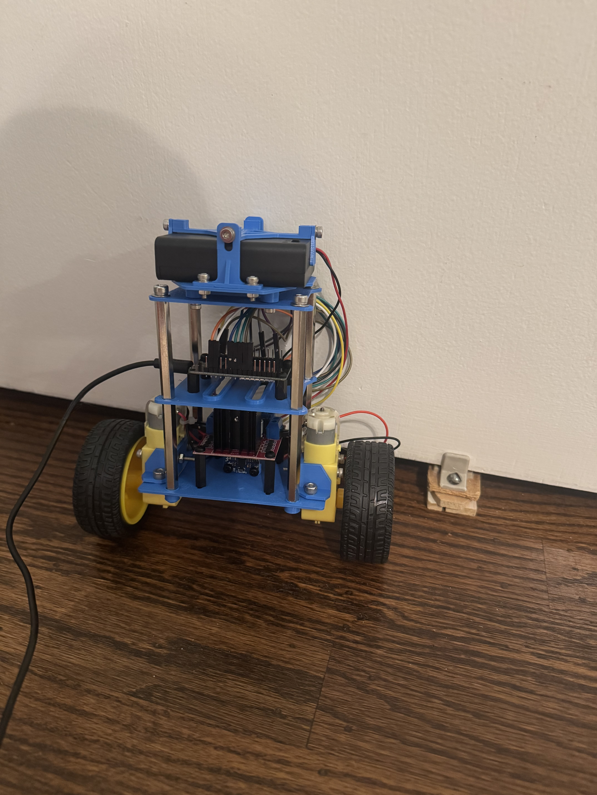

# Self-Balancing Robot — LQR Control on ESP32

A two-wheeled inverted pendulum robot that balances using a complementary-filtered
IMU estimate and a model-based LQR controller.



<!-- A short GIF of it balancing is the single highest-value thing on this page.
     Record a few seconds on your phone, convert to GIF, drop it in assets/. -->

---

## Status

Robot balances using an LQR derived control loop.
Robots x position (horizontal movement) is not controlled, therefore robot "runs away"
and needs to be bumped back and forth to stay in a constrained region.

---

## Hardware

| Component    | Part                |
| ------------ | ------------------- |
| MCU          | ESP32 DevKit        |
| IMU          | MPU6050             |
| Motor driver | L298N               |
| Motors       | TT gearmotors, 1:48 |
| Battery      | 6 V pack            |

### Pin assignment

| Function                 | GPIO         |
| ------------------------ | ------------ |
| Motor 1 — EN / IN1 / IN2 | 25 / 26 / 27 |
| Motor 2 — EN / IN3 / IN4 | 13 / 32 / 33 |
| I²C — SDA / SCL          | 21 / 22      |

### Note on center of mass

---

## State Estimation

Pitch angle is estimated with a complementary filter fusing accelerometer and
gyroscope data:

```
theta = alpha * (theta_prev + gyro_rate * dt) + (1 - alpha) * theta_accel
```

- `alpha = 0.98`, loop rate 100 Hz

- theta_accel angle comes from `atan2` of the gravity vector.

---

## Control Design

### Model

The system is modeled as an inverted pendulum on a driven cart and linearized
about the upright equilibrium.

| Parameter          | Symbol | Value   |
| ------------------ | ------ | ------- |
| Body mass          | M      | 0.10 kg |
| Wheel mass (total) | M_w    | 0.07 kg |
| CoM height         | L      | 0.15 m  |
| Wheel radius       | r      | 0.033 m |

<!-- Replace with your measured values if these change. -->

### Reduction to two states

The full control model was derived with a four-state state vector: `[x, ẋ, θ, θ̇]`. However,
the motors used for the project do not have encoders, making it difficult to measure x and ẋ.
For this reason the control model was reduced to a two-state state vector: [θ, θ̇].
This was possible because in the state equation the x and ẋ columns of matrix A do not impact θ or θ̇.

One consequence of this is there is nothing preventing the robot from "running away" to balance.
To remedy this, the next step is to add an ultrasonic sensor integrated to the controller with a cascading control loop
in order to keep the robot within a certain distance from a wall or other reference feature while balancing.

### Gains

Solved the ARE with `Q = diag(1, 0.1)`, `R = 1`:  
Q matrix prioritized theta since the primary objective of the robot is to stay upright.  
K = [ -1.047, -0.320 ].
Closed-loop eigenvalues: -3.16, -299.1

### Mapping to motor command

## Next Steps

**Cascaded position control.**

Will add an outer control loop using an ultrasonic sensor to maintain a specific distance away from the wall, while balancing

**Controller comparison.**

Will compare robot balancing performance with the control parameters derived from the LQR control method vs parameters tuned from a PID controller

---

## Repository Layout

```
├── Lib/     # Libraries for each aspect of the control loop so robot can run in different operating states
     ├── Filter/
     ├── IMU/
     ├── LQR/
     ├── Motors/
     ├── TestConfig/
├── scr/          # Main platform io script that uses the libraries
     ├── main.cpp
├── LQR_Derivation.ipynb # Walk through of the derivation for the LQR gains
├── WorkLLog.ipyn # Notebook documenting progress and changes implemented to improve performance
├── Assets/           # Photos and video
└── README.md
```

## Running It

1. Install the `Adafruit_MPU6050` and `Adafruit_Sensor` libraries.
2. Flash `main.cpp` to the ESP32.
3. Hold the robot still through startup — gyro bias calibration runs in `setup()`.
4. Stand it upright and release.
